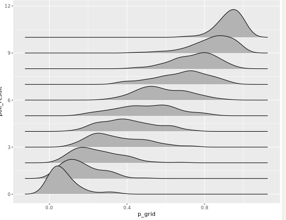
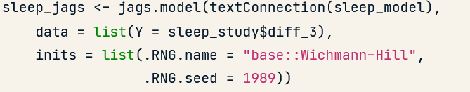

# Hierarchische Bayesianische Datenanalyse

(continuation of "Probabilistische Modellierung")

## Building a prior model

Beispiel: in einer wahl gibt es am anfang die schätzung, das wahrscheinlich 45%-55% der Stimmen an dich gehen.

Das bedeutet, dass der prior um 45/55 herum sein muss. Die art von Verteilung ist dabei nicht erzwungen, als beispiel kann man die beta verteilung verwenden. oder in R Studio:

```R
prior_A <- rbeta(n=10000,45,55)
```

n  =  anzahl and "draws", gibt dir ein dataframe der größe 10000 mit der beta verteilung

mit unterschiedlichen parametern bekommt man (natürlich) unterschiedliche priors


## Likelyhood funktion

In dem Beispiel der Wahl ist das passendstes Modell die Binomial verteilung

(Wähler sind unabhängig, und es gibt nur 2 erreignise, gewählt oder nicht gewählt)

```R
# Define a vector of 1000 p values    
p_grid <- seq(from = 0, to = 1, length.out = 1000)

# Simulate 1 poll result for each p in p_grid   
poll_result <- rbinom(n = 1000, size = 10, prob = p_grid)    

# Create likelihood_sim data frame
likelihood_sim <- data.frame(p_grid, poll_result)    

# Density plots of p_grid grouped by poll_result
ggplot(likelihood_sim, aes(x = p_grid, y = poll_result, group = poll_result)) + 
    geom_density_ridges()
```




je nachdem wie viele tatsächlich gewählt haben, gibt es unterschiedliche binomialverteilungen, also unterschiedliche likelyhood funktionen

(Wenn zb 6 gewählt haben, ist es die binomialverteilung in poll_result = 6)

```R
ggplot(likelihood_sim, aes(x = p_grid, y = poll_result, group = poll_result, fill = poll_result == 6)) + 
    geom_density_ridges()
```


Das ist dann die likelyhood funktion, was P ist, wenn 6 leute gewählt haben

## Posterior in RJAGS

Wir wissen, dass posterior ~ prior x likelyhood ist, jedoch funktioniert diese formel tatsächlich nur selten.


Stadessen können wir RJAGS  ( eine kombination von R und JAGS) verwenden, um den Posterior zu simulieren.

Zuallererst macht man ein "vote model", welches sagt, welche modelle die prior und die likelyhood verwenden

dann fügen wir in vote_jags die parameter hinzu (a 45, n 55, da wir im prior eine rund 50% chance erwarten, X = 6, da 6 leute richtig gewählt haben, und n = 10, da wir 10 Wähler hatten)

Dann können wir den posterior mit coda.samples simulieren (und das 10000 mal) und können die simulationen zusammenfassen in vote_sim

## Normal normal model

Beispiel:

Man möchte wissen, wie schlafenzug die reaktionszeit beintrechtigt

Wir schätzen, dass die Veränderung der reaktionszeit Yi Normalverteilt ist, mit der Durchschnittlichen veränderung der Reaktionszeit als mittelwert, und s als Standardabweichung

Die Standardabweichung s muss größer als 0 sein, und mit normalen schlaf ist die SD ~30 (25) ms, trozdem schätzen wir s also irgendetwas zwischen 0 und 200 ms

Auch schätzen wir, dass die mittlere Reaktionszeitveränderung m auch normal verteilt ist, mit 50 ms als der Mittelwert, und 25 als Standardabweichung.


```R
# Take 10000 samples from the m prior
prior_m <- rnorm(n = 10000, mean = 50, sd = 25)    

# Take 10000 samples from the s prior    
prior_s <- runif(n = 10000, min = 0, max = 200)    

# Store samples in a data frame
samples <- data.frame(prior_m, prior_s)

# Density plots of the prior_m & prior_s samples    
ggplot(samples, aes(x = prior_m)) + 
    geom_density()
ggplot(samples, aes(x = prior_s)) + 
    geom_density()
```

Damit wir ein posterior generieren können, brauchen wir Daten.

Diese Daten sind in "sleep_study" gegeben.  In den Daten haben die meisten eine positive Veränderung der Reaktionszeit (jedoch gab es 4 mit einer kleineren reaktionszeit!) 

Der mittelwert der veränderung ist 26ms, die sd ist 37ms

Wir schätzen, dass die normalfunktion, aus der die Daten kommen, den gleichen Mittelwert und sd haben.

Wir erstellen dann ein model für die normal Distribution, und kompilieren es in jags, mit der sleep study als data



dann simulieren wir das model (wie oben beschrieben)


### Markov Chains

Wenn man sich alle generierten m values anschaut, erkennt man, dass sie nicht 100% zufällig generiert wurden. Die werte bilden eine "Markov kette"

In den ersten 20 iterations die Werte sind zwischen 20-40, nach 100 sind die werte zwischen 0-60, usw, bis es genug werte gibt um sich an eine normalverteilung anzunähern


Es ist wichtig anzumerken, dass die markov chain nur eine ***ANNÄHERUNG*** der normalverteilung ist. Deshalb muss man eine Markov chain bewerten können

Zuallererst sollten chains stabil sein, und sich um ein wert befinden, wenn die werte rauf und hinunter schwingen, müssen wir entweder die iterations vergrößern, oder ein anderes model verwenden,.


Auch kann man mehrere Ketten generieren. Es ist okay wenn sich 2 ketten leicht unterscheiden, jedoch muss die kette wieder um einen wert tendieren, das zum beispiel wäre ein schlechtes Model.


Auch gibt es den error um den mean, wenn dieser zu groß ist, kann man einfach mehrere iterations hinzufügen, was aber rechenleistung kostet.

```R
# COMPILE the model
sleep_jags_multi <- jags.model(textConnection(sleep_model), data = list(Y = sleep_study$diff_3), n.chains = 4)   
# SIMULATE the posterior    
sleep_sim_multi <- coda.samples(model = sleep_jags_multi, variable.names = c("m", "s"), n.iter = 1000)

```

## Bayesian regressionsmodelle


Wir starten mit einem modell, welches die beziehung zwischen größe und gewicht eines menschen modellieren will

dabei ist die Größe normalverteilt, das gewicht selbst jedoch eine linerare verteilung mit b*Größe

wir sind uns sehr unsicher, was das gewicht mit 0 cm größe ist, aber wissen, dass man schwerer ist, wenn man größer ist, wissen aber nicht wie viel Deviation es gibt.


Mit Daten die wir bekommen haben, können wir den Intercept und die deviation besser definieren, auch haben wir mithilfe der Sample data ein Intercept und eine kurve berechnet.


Das model, das man erstellt, schaut so aus. Wie bereits gesagt ist die Höhe Y = normalverteilt, jedoch ist das Gewicht deterministisch zu der höhe (deshalb der <- statt ~)


Wie immer kompilieren (mit dem Dataset bdims) und simulieren es


Wie wir sehen können, sind wir uns über die Parameter sehr sicher, auch haben wir so viele Daten (507 messungen), dass die posterior und die likelyhood beinahe gleich sind.

### Posterior wahrscheinlichkeiten

aus dem Modell haben wir, wie oben gezeigt, posteriors für die variablen a b und s bekommen


Wir fokusieren auf a und b. Wir können einfach den Mittelwert der Modelle nehmen, und den plotten. Jedoch nehmen wir damit nur 1 wert aus einem ganzen modell. Wenn wir stattdessen auch die ersten 15 werte im model plotten, sehen wir das es eine unsicherheit gibt


Falls die Variablen (wie so oft dem sei) Normalverteilt ist 95% des modells zu nehmen, so ist gibt es eine 95% wahrscheinlichkeit, dass a zwischen -118.6843 und -87.470 kg, und b zwischen 0.9152 to 1.098 kg/cm ist.

```R
# Calculate the 95% posterior credible interval for b
ci_95 <- quantile(weight_chains$b, probs = c(0.025, 0.975))
ci_95

# Calculate the 90% posterior credible interval for b
ci_90 <- quantile(weight_chains$b, probs = c(0.05, 0.95))
ci_90

# Mark the 90% credible interval 
ggplot(weight_chains, aes(x = b)) + 
    geom_density() + 
    geom_vline(xintercept = ci_90, color = "red")
```


(Wenn man wissen will, was das Quantil eines bestimmten wertes ist, kann man `mean(MODEL > WERT)`  verwenden [in dem Fall quantil zwischen Wert und $\infty$])

## Bayesian regression mit kategorischen Variablen

Wir wollen die Volume (anzahl an pfadverwendern) des Oregon trails vorraussagen

Dabei spielen nicht nur ordinale, sondern auch kategorische Variablen mit (Ob es ein Wochenende ist oder nicht 0-1)


Das modell schaut so aus:

```R
rail_model_1 <- "model{
    # Likelihood model for Y[i]
    for(i in 1:length(Y)) {
      Y[i] ~ dnorm(m[i], s^(-2))
      m[i] <- a + b[X[i]]
    }

    # Prior models for a, b, s
    a ~ dnorm(400, 100^(-2))
    b[1] <- 0
    b[2] ~ dnorm(0, 200^(-2))
    s ~ dunif(0, 200)
}"
```

Dabei ist b[1] = 0, da b der kontrast zwischen Wochentag und Feiertag ist. Dieser kontrast kommt nur ins spiel, wenn X[2] ist, also wenn es ein wochentag ist. b[2] hingegen ist einfach der kontrast.

## Multivariate Bayesian regression

Bei unserem vorherigen modell haben wir nur an den Tag gedacht. Jedoch kann das Wetter auch einen großen Effekt an die anzahl an besuchern haben. Je wärmer es ist, desto mehr Besucher gibt es


Dabei ist das Modell genau gleich, nur haben wir in mi die variable c


```R
rail_model_2 <- "model{
    # Likelihood model for Y[i]
    for(i in 1:length(Y)) {
      Y[i] ~ dnorm(m[i], s^(-2))
	  m[i] <- a + b[X[i]] + c * Z[i]
    }

    # Prior models for a, b, c, s
    a ~ dnorm(0, 200^(-2))
    b[1] <- 0
    b[2] ~ dnorm(0, 200^(-2))
    c ~ dnorm(0, 20^(-2))
    s ~ dunif(0, 200)
}"
```

Da c  auf die deterministisch zu der variable Z ist, die nicht nur die werte 0 und 1 hat, gibt es dieses mal kein c[1] <- 0. 

## Bayseian regression mit der Poission regression

Mit dem vorherigen Model sind wir davon ausgegangen, dass die Besucheranzahl normalverteilt ist.

Wenn wir aber ein anderes modell verwenden wollen (zb Poission), können wir das einfach einsetzen


Jedoch können wir nicht einfach das selbe Modell für li  verwenden, li darf nicht negativ sein, stattdessen verwenden wir die log funktion.


```R
"model{
    # Likelihood model for Y[i]
    for(i in 1:length(Y)) {
        Y[i] ~ dpois(l[i])
        log(l[i]) <- a + b[X[i]] + c * Z[i]
    }

    # Prior models for a, b, c
    a ~ dnorm(0, 200^(-2))
    b[1] <- 0
    b[2] ~ dnorm(0, 2^(-2))
    c ~ dnorm(0, 2^(-2))
}"
```

