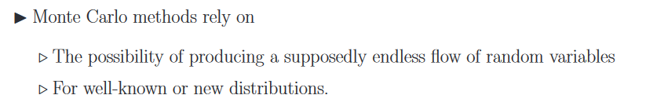
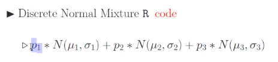

https://elearning.tgm.ac.at/mod/assign/view.php?id=240582

Bootstrapping im Regressionskontext:
Logistische Regression.

Monte Carlo Simulation: Basis des ML

Wenn ich es mir nicht berechnen kann, simuliere ich mir das Zeug oft durch um zu wissen "Was kann passieren"

Nicht alles ist berechenbar, sogar mit Computern => Monte Carlo

Was wenn man nicht integrieren kann? Rechtecke bzw Trapeze legen wenn die kurve nicht zu stark gekrimpt ist

Was wenn ich eine Spirale bzw kreise in einem Koordinatensystem sind und du sie integrieren willst?

Simulieren! Jeden punkt fragen "bist du in der spirale", und dann japunkte/neinpunkte * gesamtfläche des Koordinatensystems. Je mehr punkte desto besser, jedoch kann man es auch oft wiederholen!

Achtung: Monte Carlo basiert auf Zufallszahlen, also nicht prediktierbar (Außer man verwendet seeds, damit die zufälligen Zahlen nicht mehr zufällig sind)

Modalität kann für das Clustering verwendet werden. (unsupervised)

# Mixture distribution: 

Ich bau mir aus mehreren Wahrscheinlichkeitsverteilungen 1 neue verteilung mit y gewichten um die fläche 1 zu lassen.

# Accept-Reject Methode

Man generiert Kandidaten und testet die 
Man generiert Random Werte und fragt, passt es dazu oder nicht; 
wie vorher bei Monte Carlo; ist es in der Fläche, passt es rein?  

Man kanns in beliebige Rechnungen einsetzen ---  In der Realität ist nicht alles gleichverteilt 

Bei der Glocke in der Mitte viel und an den Rändern wenig; außen an den Rändern würde man viel wegwerfen wenn man schon weiß wies ungefähr ist zB man hat exp Funktion dann nimmt man eine exp Verteilung  

Wenn man Parameter nicht weiß, Standard nehmen  

Es gibt eine Acceptance Rate; zB 30% accepted; 70% der Sim. war unnötig weniger Laufzeit; statt 4 Stunden 2 Stunden, wenn gute Acceptance Rate 

# Monte Carlo Integration

stuff wenn man Mittelwert rechnet hat man auch immer Konfidenzintervall/Vertrauensbereich dafür 

Wie verhält sich das für wie viele Samples, die ich genommen habe? Konvergierts oder nicht?