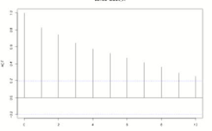
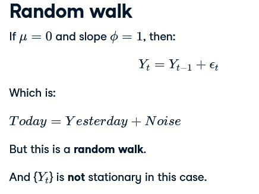

Time series  = sequence of data in chronological order; see temp/humidity nightmare of borko

Plotting shortcut:

```R
plot(Nile, xlab = "Year", ylab = "River Volume (1e9 m^{3})",main="Annual River Nile Volume at Aswan, 1871-1970",type="b")
```

type b = both; both line and points, l = line, p = points

Discrete data = evenly spaced

continues data = not evenly spaced

discrete_time_index <- 1:20


Time series data should be close to evenly spaced


The `deltat()` function returns the fixed time interval between observations and the `frequency()` function returns the number of observations per unit time. Finally, the `cycle()` function returns the position in the cycle of each observation.

```R
ts.plot(eu_stocks, col = 1:4, xlab = "Year", ylab = "Index Value", main = "Major European Stock Indices, 1991-1998")
```

ts plot for better view of time series

# Differencing


# simulating white noise

```R
arima.sim(model = list(order = c(0, 0, 0)), n = 100, mean = 100, sd = 10)
```

# Random walk models

random walk model. It is defined recursively. Today's or the current  observation is equal to yesterday's or the previous observation plus  noise or error. This error is specifically mean zero white noise.

```R
random_walk <- arima.sim(model = list(order = c(0, 1, 0)), n = 100)
```

# Stationary Time series:

A time series is stationary if parts of it stay the same througout time, eg. the mean, sd, var

RW = never stationary

WN = sometimes stationary

# Markov process:

Ein markov prozess ist ein Prozess, der nur 1 Zeitschritt zurück abhängig ist.

# Covariance and correlation

Covariance: A positive covariance implies a positive association between the functions, and a negative cov a negative association. 

However, the actual value of the cov doesnt tell us much, since its depended on the scale ofthe variables

Correlation: Derived from the covariance, standardized so it can tell us how linear correlated it is

-1 <=> 0 <=> 1

# Autocorrelation:

anstatt eine Korrelation mit anderen funktionen zu finden, kann man eine korrelation mit früheren Werten finden.

```R
cor(stock_A[-100],stock_A[-1])
```

Das ist eine correlation zwischen allen werten ohne index 100 ([-100]) und allen werten ohne index 1 ([-1]) (R startet mit 1...)


BK = börsenkurs.

```
cor(stock_A[-(99:100)],stock_A[-(1:2)])
```

correlation zwischen funktion im zeitwert heute und vorgestern.

Wenn man autocorrelationen von mehreren Zeitwerten haben will, kann man acf verwenden:

```R
acf(stock_A,lag.max = 2)
```

^ autocorrelation von gestern und vorgestern wenn verglichen mit heute, 2 werte.



Diese funktion zeigt, wie sich die autocorrelation over time verändert.

# Autoregression.


oscillatory = more likely to go back and forth instead of rising and lowering


| $$\phi$$ = 0.98 | $$\phi$$ = -0.6 |
| --------------- | --------------- |
| $$\phi$$ = 1.6  | $$\phi$$ = 1.6  |

Eine Autoregression hat (natürlich) auch eine Autocorrelation


Dabei ist der decay der Correlation abhängig von $$\phi$$ 

| $$\phi$$ = 0.95 | $$\phi$$ = 0.75 |
| --------------- | --------------- |
| $$\phi$$ = 0.2  | $$\phi$$ = -0.9 |

