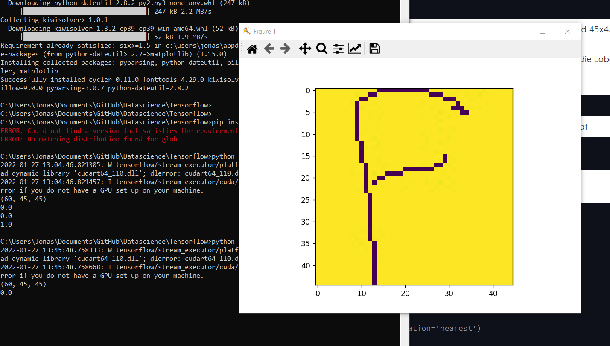
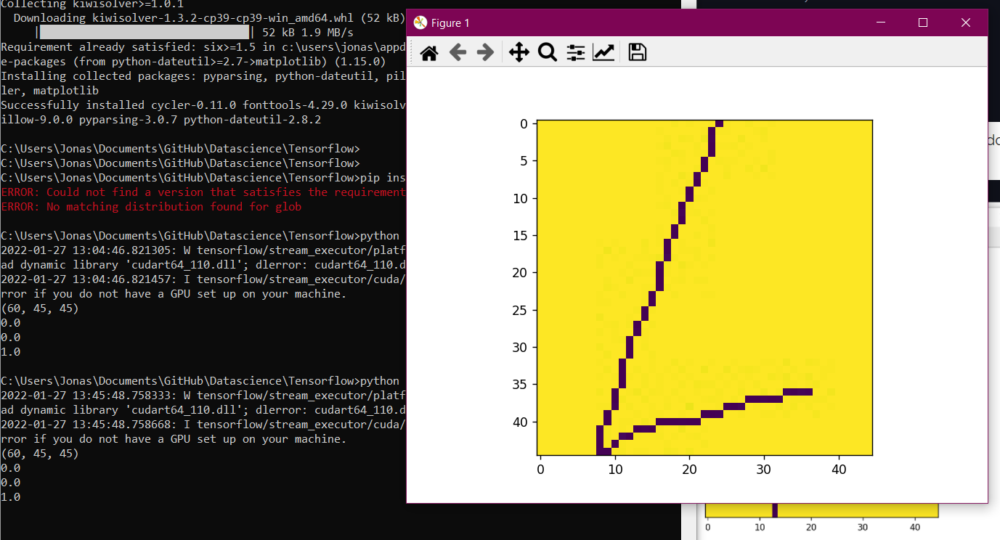

# Data Science ``Neuronale Netzwerke - TensorFlow''

Lilly Elgebaly und Jonas Trebicki 5CHIT

2021-01-27

----

Nutze deine erworbenen Fertigkeiten zum Erstellen von TensorFlow  Modellen, um für den Datensatz zur Bilderkennung ein Neuronales Netzwerk anzupassen.

Nutze dafür einen [Datensatz zur Mustererkennung von handgeschriebenen Mathematiksymbolen](https://www.kaggle.com/xainano/handwrittenmathsymbols) von  [kaggle](https://www.kaggle.com/).

----

Es wird mit Python umgesetzt

Alle Nodes verwenden Relu außer natürlich der Output Node, dieser funktioniert mit einer Sigmoidfunktion

### Daten/Bilder einlesen, Datensätze definieren

Zuerst wird mithilfe des glob packages in python alle Bilder eingelesen

```
ffilelist = glob.glob('Letters/f30/*.jpg')
lfilelist = glob.glob('Letters/l30/*.jpg')
```

Danach wird ein Numpy Array geschaffen, welches aus 2D Arrays der Bilder besteht (siehe nächste Methode *imageToArray*)

```
fArray = np.array([imageToArray(fname) for fname in ffilelist])
lArray = np.array([imageToArray(fname) for fname in lfilelist])
```

imageToArray lädt die einzelnen Bilder in Graustufen; danach werden diese Bilder mit der Keras Methode "img_to_array" in ein tatsächliche Array umgewandelt (Keras ist eine Deep Learning API; in TensorFlow enthalten). Dieses Array ist "praktisch" dreidimensional, enthält die Pixel des Bildes und das es in Graustufen ist.

Dieses Array wird dann in ein Numpy Array gegeben; Danach wird noch Reshape verwendet, damit es ein 2D Array mit der Größe 45x45 ist. (Die gegebenen Bilder sind 45x45 Pixel). Danach wird noch jeder Wert in dem Array/der Matrix durch 255 gerechnet, damit die Werte nicht mehr von 0 bis 255 reichen, sondern nur von 0 bis 1.

```
def imageToArray(path):
    img = load_img(path, color_mode="grayscale")
    img_array = img_to_array(img)
    img_np = np.array([img_array])
    img_np = img_np.reshape(45, 45)
    img_np /= 255.0
    return img_np
```

Wir fügen beide Arrays zu einem großen "letterArray" zusammen

Wir geben die Shape aus, um zu verfizieren, dass wir alles richtig gemacht haben

```
letterArray = np.concatenate((fArray, lArray))
print(letterArray.shape)
```

```
(60, 45, 45)
```

Es gibt 60 2D Arrays; wir haben 30 von jedem der beiden Buchstaben, und all diese 2D Arrays sind 45x45 groß, also ist es richtig.

Wir definieren ein labelArray; die ersten 30 Werte sind Nullen und die letzten 30 Einsen. Das sind die Labels für die Buchstaben in unserem Array (0 ist der erste Buchstabe, 1 der zweite; wir haben sie ja nacheinander in letterArray gegeben, also passt das)

```
labelArray = np.append(np.zeros((30, 1)), np.ones((30, 1)))
```

Für Punkt 2 der Aufgabe mischen wir die Arrays, das es beim Lernen eine zufällige Reihenfolge hat

```
letterArray_shuffled, labelArray_shuffled = unison_shuffled_copies(letterArray, labelArray)
```

Unison Shuffled Copies ist eine Methode, welche die Arrays gleich mischen (damit die Labels und Daten wieder zusammenpassen)

```
# https://stackoverflow.com/questions/4601373/better-way-to-shuffle-two-numpy-arrays-in-unison
def unison_shuffled_copies(a, b):
    assert len(a) == len(b)
    p = np.random.permutation(len(a))
    return a[p], b[p]
```


### Testen dieser Funktionen

```
print(labelArray_shuffled[0])
plt.imshow(letterArray_shuffled[0], interpolation='nearest')
plt.show()

print(labelArray_shuffled[3])
plt.imshow(letterArray_shuffled[3], interpolation='nearest')
plt.show()

print(labelArray_shuffled[20])
plt.imshow(letterArray_shuffled[20], interpolation='nearest')
plt.show()
```

Zum Testen unseres Programmes geben wir zufällig die Labels dreier Elemente aus und das "Bild" (das Array wird wieder als Bild dargestellt) dazu (derweil muss es richtig sein, weil wir die Labels selbst gesetzt haben)





### Aufteilung in Test und Trainingsdaten

```
#Filelists
# Dateien einlesen/Dateiliste erstellen
ffilelist = glob.glob('Letters/f30/*.jpg')
lfilelist = glob.glob('Letters/l30/*.jpg')

#create Arrays out of the images (and shuffle them)
# Wir shuffeln die Arrays gleich am Anfang
fArray = np.array([imageToArray(fname) for fname in ffilelist])
np.random.shuffle(fArray)
lArray = np.array([imageToArray(fname) for fname in lfilelist])
np.random.shuffle(lArray)

#split the arrays into 20-10 Arrays
# Mit np.split teilen wir die Daten auf: ein 20 Elemente Array mit Trainingsdaten und ein 10 Elemente Array zum Test
fTraining, fTest = np.split(fArray, [20,])
lTraining, lTest = np.split(lArray, [20,])

#add the different letters together into training and label arrays
# Arrays zusammenfügen
letterTraining = np.concatenate((fTraining, lTraining))
letterTest = np.concatenate((fTest, lTest))


# Add a label array (0 = letter 0, 1 = letter 1)
# Arrays für die Labelsbauen
labelTraining = np.append(np.zeros((20, 1)), np.ones((20, 1)))
labelTest = np.append(np.zeros((10, 1)), np.ones((10, 1)))

# Shuffel the label and training arrays at the same time, so that ex Letter 2 still corresponds to its original label
letterTraining_shuffled, labelTraining_shuffled = unison_shuffled_copies(letterTraining, labelTraining)
```


### Model aufbauen

https://www.tensorflow.org/api_docs/python/tf/keras/losses

https://www.tensorflow.org/api_docs/python/tf/keras/losses/BinaryCrossentropy

Wir verwenden BinaryCrossentropy (wir haben zwei distinkte Klassen, vorher haben wir andere probiert, die haben nicht so gut funktioniert und hohe Losses gegeben)

```
################Model 1################  
model_1 = keras.Sequential()
model_1.add(keras.layers.Dense(8, activation='relu', input_shape=(45,45,)))
model_1.add(keras.layers.Dense(8, activation='relu'))
model_1.add(keras.layers.Dense(1, activation='sigmoid'))
model_1.compile(optimizer=keras.optimizers.Adam(lr=0.001), loss='binary_crossentropy')
model_1.fit(fTraining, np.zeros((20,1)), epochs=1000, validation_split=0.5)
model_1.fit(lTraining, np.ones((20,1)), epochs=1000, validation_split=0.5)
################Model 1################  


################Model 2################  
model_2 = keras.Sequential()
model_2.add(keras.layers.Dense(8, activation='relu', input_shape=(45,45,)))
model_2.add(keras.layers.Dense(8, activation='relu'))
model_2.add(keras.layers.Dense(1, activation='sigmoid'))
model_2.compile(optimizer=keras.optimizers.Adam(lr=0.001), loss='binary_crossentropy')
model_2.fit(letterTraining_shuffled, labelTraining_shuffled, epochs=2000, validation_split=0.5)
################Model 2################ 
```

Wir bauen zwei Modelle mit zwei Schichten; beim ersten Modell geben

wichtig sind hier der Optimizer und die Loss Funktion

Der Loss beschreibt wie schlecht das Modell ist (je größer, desto schlechter)

```
################Model 3################  
model_3 = keras.Sequential()
model_3.add(keras.layers.Dense(4, activation='relu', input_shape=(45,45,)))
model_3.add(keras.layers.Dense(4, activation='relu'))
model_3.add(keras.layers.Dense(4, activation='relu'))
model_3.add(keras.layers.Dense(4, activation='relu'))
model_3.add(keras.layers.Dense(4, activation='relu'))
model_3.add(keras.layers.Dense(1, activation='sigmoid'))
model_3.compile(optimizer=keras.optimizers.Adam(lr=0.001), loss='binary_crossentropy')
model_3.fit(letterTraining_shuffled, labelTraining_shuffled, epochs=2000, validation_split=0.5)
################Model 3################  


################Model 4################  
model_4 = keras.Sequential()
model_4.add(keras.layers.Dense(16, activation='relu', input_shape=(45,45,)))
model_4.add(keras.layers.Dense(1, activation='sigmoid'))
model_4.compile(optimizer=keras.optimizers.Adam(lr=0.001), loss='binary_crossentropy')
model_4.fit(letterTraining_shuffled, labelTraining_shuffled, epochs=2000, validation_split=0.5)
################Model 4################  


```

Wir bauen dann noch Modelle mit nur zwei Schichten und mit 6 Schichten

Wir evaluieren die Modelle dann mit unseren Testdaten

```
print("MODEL 1 EVALUATION")
print(model_1.evaluate(letterTest, labelTest))
print("MODEL 2 EVALUATION")
print(model_2.evaluate(letterTest, labelTest))
print("MODEL 3 EVALUATION")
print(model_3.evaluate(letterTest, labelTest))
print("MODEL 4 EVALUATION")
print(model_4.evaluate(letterTest, labelTest))
```

Wir haben nur 20 Bilder